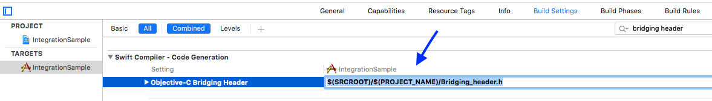

# MobileBridge Integration in Swift Project #

**Note**: this page assumes you have already downloaded `MobileBridge` framework and `AWS-iOS-SDK`.
## Requirements ##

A `Client-Key` and `Client-Secret` are required to use the `MobileBridge` framework.

Requires `XCode 7` or higher, `iOS 8.0` and above. Built using `ARC`.

## Integration ##

* Add `MobileBridge.framework`, `MobileBridge.bundle` and `AWS-iOS-SDK-xxx` to your project.
* Make sure following frameworks are added in `Xcode` project's `Build Phases`:
  * `MessageUI.framework` 
  * `CoreMedia.framework`
  * `AudioToolbox.framework`
  * `AdSupport.framework`
  * `CoreTelephony.framework`
  * `SystemConfiguration.framework`
  * `MapKit.framework`
  * `CoreLocation.framework`
  * `Security.framework`
  * `CoreBluetoth.framework`
  * `Social.framework`
  * `Foundation.framework`
  * `CoreMotion.framework`
  * `QuartzCore.framework`

* Add following compiler flags to `Other Linker Flags` under `Linking` section in `Xcode` project's `Build Settings`:
  * `-lz` 
  * `-ObjC` 
  * `-all_load` 
  * `-lsqlite3.0` 
  * `-lxml2`

* Add `Bridging-Header` to your project by performing `XCode`->`New File`->`Header File`.

* Import `MobileBridge.h` in newly created header `Bridging-Header` file:

* Set path to `Bridging-Header.h` under `Swift-Compiler - Code Generation` section in `Xcode` project's `Build Settings`:

Clean&Compile `XCode` project, you would be able start using `MobileBridge` framework in your project.

## Sample project ##

Check out our `IntegrationSample` project as an example of `MobileBridge` framework integration into `Swift` project.

